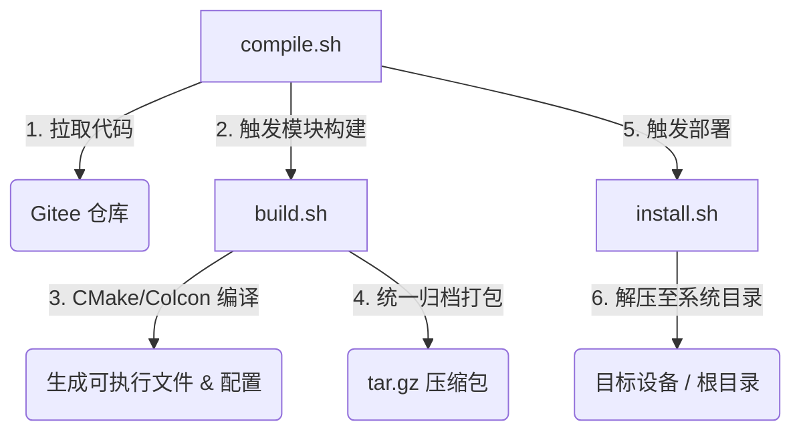

[toc]

---

对于你的第一个问题：
**CMake 参数 `EXECUTABLE_OUTPUT_PATH` 指定的目录需要提前创建吗？**

不需要。

CMake 非常智能。当你通过 `EXECUTABLE_OUTPUT_PATH` 指定输出目录，或者使用 `file(COPY ... DESTINATION ...)` 时，如果目标目录（及其所有父目录）不存在，CMake 会**自动递归创建**这些目录（类似于 `mkdir -p` 的行为）。所以你可以放心地把路径直接传给它。

针对你提供的笔记，我为你整理了一份结构清晰、适合在团队内部分享和归档的 Markdown 文档：

***

# AGV 系统自动化构建与打包部署体系说明

本文档旨在说明当前项目中使用的自动化脚本体系：`compile.sh -> build.sh -> install.sh`，这套体系负责从代码拉取、本地编译、文件打包到最终系统级部署的全流程工作。

## 1. 整体架构图及其概述

目前的自动化打包体系负责将代码从 Gitee 拉取到本地 Docker 工作区，对各个模块进行编译构建，将构建产物（二进制程序、配置、资源等）打包成 tar.gz，最后解压部署到目标环境的根目录（/）下。

工作目录约定：

- 代码工作区: /home/docker_share/workspace
- 打包安装区: /home/docker_share/install
- 目标部署路径: 最终产物将被部署在 /home/byd/node 及 /home/byd/config 等目录下。

整个打包部署体系由三个核心脚本串联完成，执行流如下：



## 2. 脚本工作流拆解

### 2.1 顶层入口：`compile.sh`
**作用**：负责从远端拉取最新代码，并调度对应模块的构建与安装。

1. **拉取代码 (`function_pull`)**：
   - 脚本通过传入模块名（如 `function_pull "agv_server_pubsub"`），将指定 Gitee 仓库的最新代码拉取到本地统一的工作空间。
   - **工作目录**：`/home/docker_share/workspace/agv_server_pubsub`
2. **构建模块**：
   - 进入对应的模块目录，执行该目录下的 `build.sh`。
   - **参数说明**：携带 `-c` 参数表示使用 `colcon` 编译（适用于 ROS 包），不带参数则默认使用 `cmake` 构建。
3. **安装模块**：
   - 所有模块编译并打包完成后，进入 `/home/docker_share/install` 目录，统一执行 `install.sh` 部署到设备系统。

### 2.2 构建与打包核心：`build.sh`
**作用**：负责在模块内部执行具体的编译动作，并将散落的编译产物集中提取，打成标准化的 Tar 压缩包。

1. **环境准备与进入模块**：
   - 脚本运行在当前模块的根目录下（例如：`/home/docker_share/workspace/agv_server_pubsub`，记为 `$pwd`）。
2. **CMake 构建配置 (`function_cmake_build`)**：
   - 创建并进入 `$pwd/build` 目录。
   - 执行 `cmake` 命令时，通过宏变量注入**绝对路径**，强制要求 CMake 将产物输出到我们指定的“伪系统目录”中：
     ```bash
     cmake -DEXECUTABLE_OUTPUT_PATH=$pwd/home/byd/node/agv_server_pubsub/bin \
           -DCONFIG_INSTALL_DIR=$pwd/home/byd/config \
           -DCMAKE_BUILD_TYPE=Release ..
     ```
   - 执行 `make`。此时二进制文件和配置文件会被 CMake（结合 `file(COPY)` 等指令）自动送入 `$pwd/home/byd/...` 结构中。
3. **整理与打包 (`function_pack`)**：
   - 回到模块根目录 `$pwd`。
   - 创建系统临时目录（`$temp_dir/home/byd`）。
   - 将刚才生成产物的目录（`$pwd/home/byd/node` 和 `$pwd/home/byd/config`）整体复制到 `$temp_dir/home/byd/`。
   - **生成压缩包**：
     ```bash
     tar -czvf byd_agv_server_pubsub.tar.gz -C "$temp_dir" "home" "usr"
     ```
     *注：使用 `-C "$temp_dir"` 是为了在打包时剥离前缀路径，使得压缩包内的顶层结构就是 `home/` 和 `usr/`。*
   - 将生成的 `.tar.gz` 文件移动到统一归档目录 `/home/docker_share/install/`。

### 2.3 部署安装：`install.sh`
**作用**：将打好的标准化包解压到目标运行设备的真实文件系统中。

1. **解压部署**：
   - 脚本遍历 `/home/docker_share/install/` 下的所有压缩包。
   - 执行解压：`tar -xzf "$tar_gz_file" -C /`
   - **原理说明**：由于压缩包内自带 `home/byd/node` 和 `home/byd/config` 的完整目录树，解压到设备根目录 `/` 后，文件会自动覆盖并落位到系统的 `/home/byd/node` 和 `/home/byd/config` 下，实现绿色、无感部署。

## 3. 开发规范与注意事项

为了适配这套自动化打包体系，各 C++ 模块在编写 `CMakeLists.txt` 时需遵守以下约定：

1. **支持宏变量输出**：必须能够接收并处理 `EXECUTABLE_OUTPUT_PATH` 和 `CONFIG_INSTALL_DIR` 变量，以配合 `build.sh` 的路径劫持。
2. **优先使用 `file(COPY)`**：对于配置文件或静态资源（如 `web` 目录），推荐在 CMake 配置阶段使用 `file(COPY ... DESTINATION ...)` 将它们拷贝到上述宏变量指定的路径下。
3. **相对路径引用**：C++ 代码中读取资源时，应以自身的二进制位置为基准使用相对路径（例如 `../config/` 或 `../web/`），确保打包解压后目录结构依然有效。